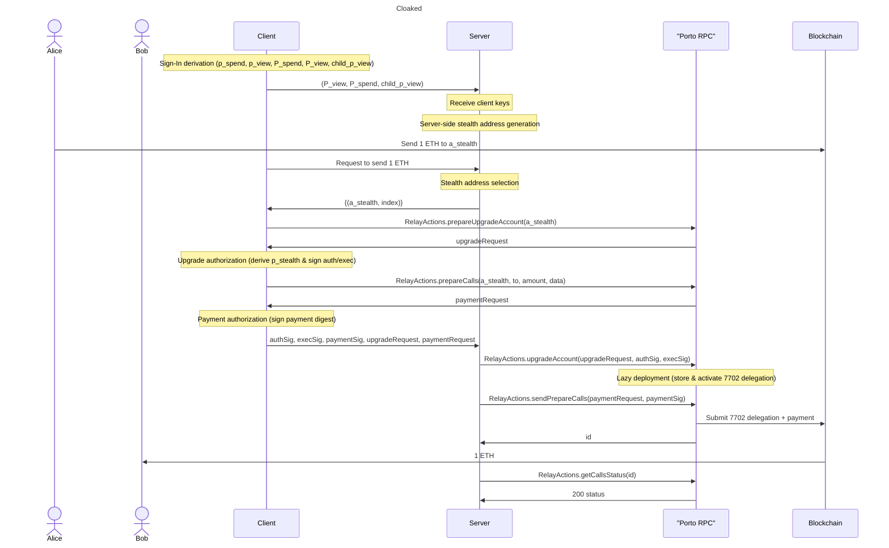

<div align="center">
  
</div>

# clkd-stealth

A TypeScript library providing cryptographic primitives for deriving spending and viewing keys from signatures, generating stealth addresses, and managing hierarchical deterministic (HD) key derivations.

## Installation

```bash
npm install @cloakedxyz/clkd-stealth
# or
pnpm add @cloakedxyz/clkd-stealth
# or
yarn add @cloakedxyz/clkd-stealth
```

## Architecture



## Detailed Notes

### 1. Sign-In Derivation

```bash
sig       = sign(p, msgHash)

p_spend   = SHA256(first_half_sig)
p_view    = SHA256(second_half_sig)

P_spend   = toPubKey(p_spend)
P_view    = toPubKey(p_view)

master_p_view = bip32.fromMasterSeed(p_view)
child_p_view  = bip32.ckd(master_p_view, "m/5564'/0'")
```

**Security Note:** Client sends only `child_p_view`, not `p_view`, to protect the full viewing key from the server.

---

### 2. Server-Side Stealth Address Generation

```bash
coin_type = ensip11(chainId)
c0 = coin_type.firstHalf
c1 = coin_type.secondHalf
```

```bash
if nonce > 0xfffffff:
    parent_nonce = nonce / (0xfffffff + 1)
    nonce        = nonce % (0xfffffff + 1)
else:
    parent_nonce = 0
```

```bash
index = "m/c0'/c1'/0'/parent_nonce'/nonce'"
```

```bash
p_derived = bip32.ckd(child_p_view, index)
S         = p_derived * P_spend  // ECDH shared secret
r         = keccak(S)
P_stealth = P_spend * r
a_stealth = addr(P_stealth)      // EOA address
```

**Note:** `p_derived` replaces the random `p_ephemeral` in EIP-5564, making stealth addresses deterministic and recoverable.

---

### 3. Stealth Address Selection

The server maintains a set of stealth addresses it generated for the user and chooses the optimal one to spend from based on deposits, balances, and gas efficiency.

---

### 4. Upgrade Authorization (Client)

```bash
p_derived = bip32.ckd(child_p_view, index)
P_derived = toPubKey(p_derived)

S         = P_derived * p_spend  // ECDH shared secret
r         = keccak(S)

p_stealth = p_spend * r
```

```bash
authSig = sign(p_stealth, upgradeRequest.digest.auth)
execSig = sign(p_stealth, upgradeRequest.digest.exec)
```

---

### 5. Payment Authorization

```bash
paymentSig = sign(p_stealth, paymentRequest.digest)
```

---

### 6. Lazy Deployment (Porto RPC)

Porto RPC stores ERC-7702 delegation and applies/activates it only when needed (first call requiring it).

---

### 7. Execution Flow

1. Server sends upgrade + prepareCalls bundle.
2. Porto RPC:
   - publishes 7702 delegation
   - deploys/upgrades account
   - executes payment
3. Blockchain transfers **1 ETH → Bob**.
4. Server polls status until `200`.

## References

### Standards & Specifications

- [EIP-5564: Stealth Addresses](https://eips.ethereum.org/EIPS/eip-5564) - Stealth address standard
- [ENSIP-11: EVM Address Resolution](https://docs.ens.domains/ensip/11) - Coin type derivation for EVM chains
- [BIP-32: Hierarchical Deterministic Wallets](https://github.com/bitcoin/bips/blob/master/bip-0032.mediawiki) - HD wallet standard
- [ERC-7702: Set code for an address using a signature](https://eips.ethereum.org/EIPS/eip-7702) - Account abstraction via delegation

### Related Projects

- [Umbra Protocol](https://github.com/ScopeLift/umbra-protocol) - Privacy-preserving stealth address protocol (key derivation inspiration)
- [Fluidkey Stealth Account Kit](https://github.com/fluidkey/fluidkey-stealth-account-kit) - Stealth account implementation (HD key derivation inspiration)
- [Porto Relay](https://porto.sh) - Account abstraction relay service

## License

MIT
